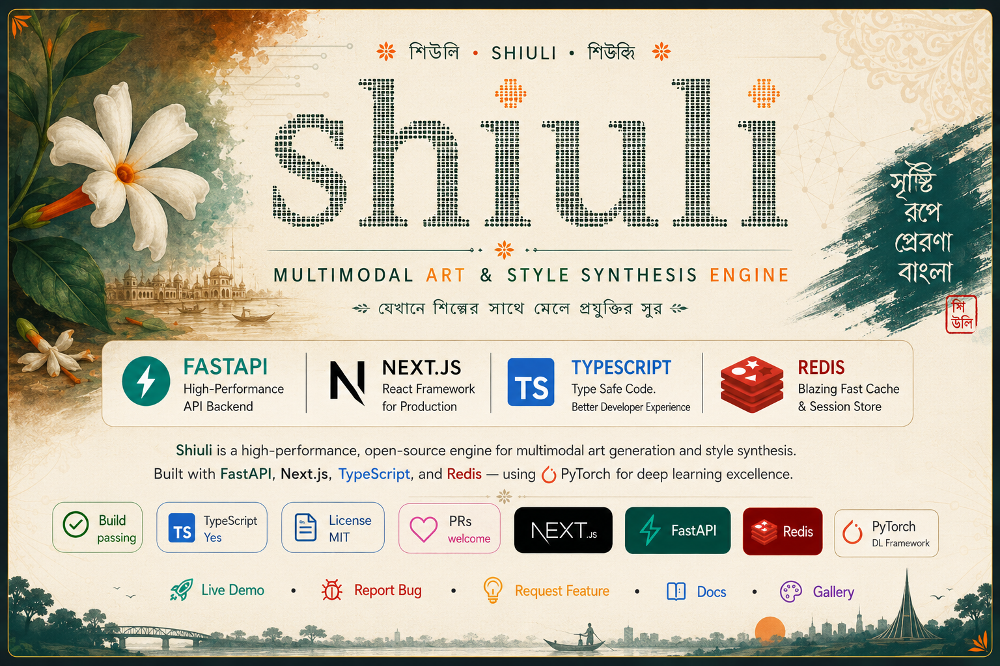

<div align="center">



*Multimodal Art &amp; Style Synthesis Engine*

<br/>

[](#)
[](LICENSE)
[](#)
[](#)
[](#)


<br/>

[**Live Demo**](#) · [**Report Bug**](../../issues) · [**Request Feature**](../../issues) · [**Docs**](#)

</div>

<br/>

---

# 🌼 Shiuli

> **Shiuli** is an enterprise-grade **Multimodal Art & Style Synthesis Engine** built with **FastAPI** as its primary backend framework and **PyTorch** as its deep learning framework. Inspired by the Bengali *Shiuli* flower, the project demonstrates production-ready AI engineering, multimodal learning, and scalable deployment.

## Highlights

- **Backend:** FastAPI
- **Deep Learning:** PyTorch
- **Frontend:** Next.js + TypeScript + Tailwind CSS
- **Database:** PostgreSQL
- **API:** REST + OpenAPI
- **Containerization:** Docker & Docker Compose
- **CI/CD:** GitHub Actions
- **Testing:** Pytest
- **Experiment Tracking:** MLflow
- **Data Versioning:** DVC

## Vision

Shiuli bridges classical deep learning (ANN, CNN, RNN/LSTM, GAN) with modern multimodal AI into a modular, enterprise-grade platform for research and production.

## Architecture

```text
Frontend (Next.js)
        │
        ▼
FastAPI Backend
        │
 ┌──────┼────────┐
 │      │        │
Training Inference API
 │      │        │
 └──────┼────────┘
        ▼
 PyTorch Models
        │
        ▼
 PostgreSQL / MLflow / DVC
```

## Repository Structure

```text
shiuli/
├── backend/
│   ├── api/
│   ├── core/
│   ├── models/
│   ├── training/
│   ├── inference/
│   └── services/
├── frontend/
├── datasets/
├── experiments/
├── notebooks/
├── configs/
├── docker/
├── docs/
├── scripts/
├── tests/
└── .github/
```

## Deep Learning Modules

- ANN — Classification & embeddings
- CNN — Visual feature extraction
- RNN/LSTM — Sequential style modelling
- GAN — Image generation & style synthesis
- Future: Vision Transformers, CLIP, Diffusion Models

## Engineering Practices

- Clean Architecture
- SOLID Principles
- Type-safe Python
- Ruff, Black, MyPy
- Pytest
- Docker
- GitHub Actions
- MLflow
- DVC
- Observability-ready

## Roadmap

1. Data ingestion & preprocessing
2. CNN feature encoder
3. RNN/LSTM style encoder
4. GAN synthesis engine
5. FastAPI inference service
6. Frontend studio
7. MLOps & cloud deployment
8. Transformer & diffusion integration

## License

MIT License.

---
**Shiuli (শিউলি)** celebrates Bengali creativity while showcasing enterprise-grade AI engineering.
